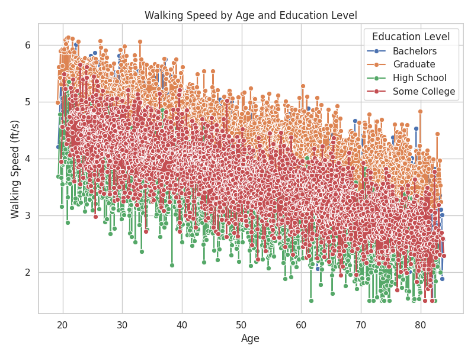
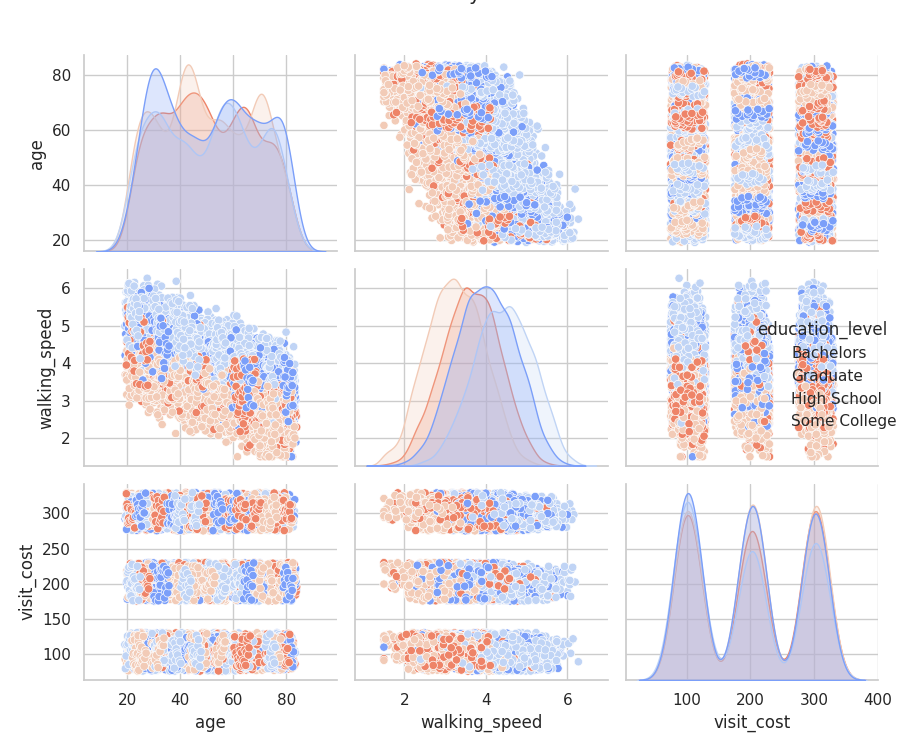

# DATASCI 217 FINAL EXAM
### Name: Belinda Chen

## Question 1: Data Preparation with Command-Line Tools
The goal of part 1 was to clean the raw data (ms_data_dirty.csv) to remove inconsistencies and extract the essential columsn for further analysis. The steps taken included:
- using grep and sed to remove the comments, empty lines, and additional punctuation
- extracted the required columns: patient_id, visit_date, age, education_level, walking_speed
- filtered for rows with walking speed between 2.0 and 8.0 ft/s
- assigned unique insurance types (basic, premium, platinum) to each patient 
- saved the clean data as ms_data.csv

Below are the first four records of the cleaned dataset. There are 15477 total visits.
| Patient   | Visit Date   | Age   | Education Level | Walking Speed |
|-----------|--------------|-------|-----------------|---------------|
| P0001     | 2020-01-29   | 71.55 | Graduate        | 4.05          |
| P0001     | 2020-05-10   | 71.82 | Graduate        | 3.53          |
| P0001     | 2020-08-20   | 72.10 | Graduate        | 3.76          |
| P0001     | 2020-11-04   | 72.31 | Graduate        | 4.05          |

## Question 2: Statistical Analysis
The goal of part 2 was to perform walking speed analyses and cost analyses to understand the impact of other factors on walking speed. For walking speed, we found that older patients tend to have slower walking speeds, and higher education levels are associated with slightly faster walking speed (which then varies by age).

| Education Level | Walking Speed (ft/s) |
|-----------------|-----------------------|
| Bachelors       | 3.989763             |
| Graduate        | 4.446709             |
| High School     | 3.229245             |
| Some College    | 3.654823             |

For cost analyses, one-way ANOVA was conducted to assess differences in visit costs by insurance type. Effect sizes were calculated to measure the impact of insurance type on visit costs. We found that platium plans had significantly higher mean visit costs than basic or premium plans. Insurance plans explains a large proportion of variance in visit costs. 

Mean Costs by Insurance Type:
|insurance_type | Cost |
|-----------------|-----------------------|
| Basic  |    100.146445 |
|Platinum   |    300.182263 |
|Premium School  |   200.075941 |

The correlation between age and walking speed is -0.6891. 

Looking at seasonal variations, considering Dec-Feb as winter, March-May as spring, June-August as summer, and Sept-Nov as fall, we see these seasonal trends. 
| Season  | Mean Walking Speed (ft/s) |
|---------|----------------------------|
| Fall    | 3.966402                  |
| Spring  | 3.820916                  |
| Summer  | 4.150794                  |
| Winter  | 3.270018                  |

When taking into account these seasonal variations and possible increased costs of insurance due to the season (higher in fall and winter, lower in spring), we get the following updated costs. 

| Season  | Mean Costs ($)    |
|---------|--------------------|
| Fall    | 208.804580         |
| Spring  | 199.103808         |
| Summer  | 202.950880         |
| Winter  | 213.037456         |

## Question 3: Statistical Analysis 

The goal of this part was to create models that would accurately explain the relationships between walking speed, education, age, and insurance and how each of these factors impact each other. With OLS between walking speed and (education and age), we obtained an adjusted R-squared of 0.504, which suggests that 50.4% of the variance in walking speed is explained by the predictors of education and age. The following table shows the results of the mixed effects model. 

| Parameter         | Coefficient | Std. Error | z-value  | P>|z| | 95% CI (Lower) | 95% CI (Upper) |
|-------------------|-------------|------------|----------|------|----------------|----------------|
| Intercept         | 5.913       | 0.048      | 123.816  | 0.000 | 5.819          | 6.006          |
| Age               | -0.033      | 0.001      | -42.999  | 0.000 | -0.035         | -0.032         |
| Education Code    | -0.244      | 0.012      | -20.025  | 0.000 | -0.268         | -0.220         |
| Group Variance    | 0.121       | 0.016      | -        | -     | -              | -              |

To conduct the cost analyses, we conducted a one-way ANOVA to assess differences in visit costs by insurance type and calculated the effect size to measure the impact of insurance type on visit costs. We found that platinum plans had significantly higher mean visit costs than basic and premium plans, suggesting that insurance type explains a large proportion of variance in visit costs. 

| Insurance Type | Mean Costs ($) | Median Costs ($) |
|----------------|----------------|------------------|
| Basic          | 102.590624     | 102.392004       |
| Platinum       | 302.559134     | 302.543044       |
| Premium        | 202.514895     | 202.845336       |

For our advanced analysis, we fitted an OLS model to control for confounders. We determine that education_code, insurance_type, and month were confounders. The adjusted R-squared was 0.525, which went up from the adjusted R-squared of the unadjusted model. 

## Question 4: Data Visualization 
The goal of this part was to visualize walking speed, cost analysis, and combined visualizations. During the walking speed analysis, we created a scatter plot of age against walking speed, a boxplot of walking speed by education level, and a line plot of education-age interactions.

This plot shows that walking speed decreases as age increases.

This plot suggests that higher levels of education correlate with faster walking speeds. 

Similarly, we are about to see that walking speed decreases over time as age increases, regardless of education level. We continue to see the trend that higher education levels correspond to faster walking speeds.

We also visualize the cost analysis by plotting the barplot of mean costs by insurance type and a box plot showing costs distributions.

We see that mean platinum insurance costs are significantly higher than basic or premium plans, and it is confirmed by the boxplot showing cost distributions. 

Finally, we combined visualization to see pair plots of key variable and time trends. 

